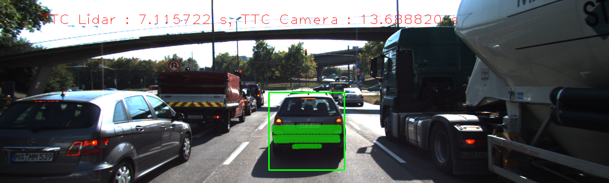
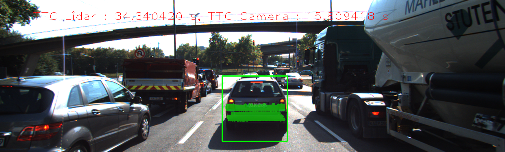
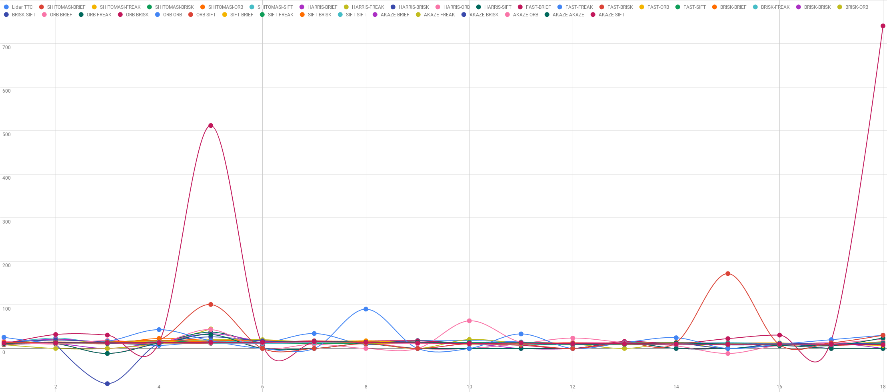
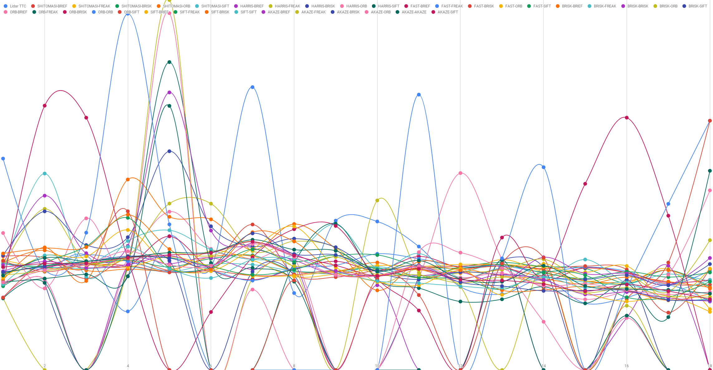
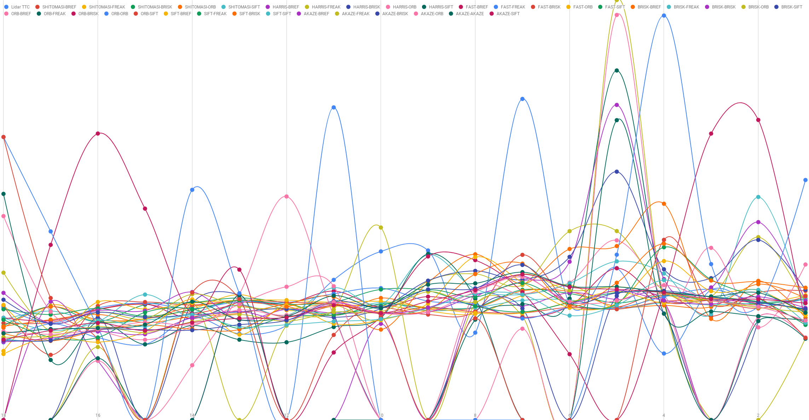
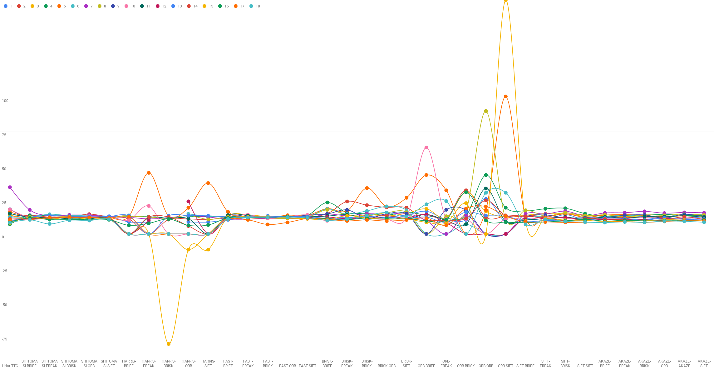

# SFND 3D Object Tracking

Welcome to the final project of the camera course. By completing all the lessons, you now have a solid understanding of keypoint detectors, descriptors, and methods to match them between successive images. Also, you know how to detect objects in an image using the YOLO deep-learning framework. And finally, you know how to associate regions in a camera image with Lidar points in 3D space. Let's take a look at our program schematic to see what we already have accomplished and what's still missing.

In this final project, you will implement the missing parts in the schematic. To do this, you will complete four major tasks: 
1. First, you will develop a way to match 3D objects over time by using keypoint correspondences. 
2. Second, you will compute the TTC based on Lidar measurements. 
3. You will then proceed to do the same using the camera, which requires to first associate keypoint matches to regions of interest and then to compute the TTC based on those matches. 
4. And lastly, you will conduct various tests with the framework. Your goal is to identify the most suitable detector/descriptor combination for TTC estimation and also to search for problems that can lead to faulty measurements by the camera or Lidar sensor. In the last course of this Nanodegree, you will learn about the Kalman filter, which is a great way to combine the two independent TTC measurements into an improved version which is much more reliable than a single sensor alone can be. But before we think about such things, let us focus on your final project in the camera course. 

# Notes:
To avoid the LIDAR error `Outliers from the car` i added a check between min distance and 2nd min. value if the difference is larger than 4 cm it takes the 2nd min. value to execlude the min. which is wrong in this case

# Results:
## Performance Evaluation 1 [LIDAR]:
### Examples where the TTC estimate of the Lidar sensor does not seem plausible:
* In frame #4 the lidar ttc result is 7 which is low compared to average of other frames, in which lidar readings was that current = 7.638 m and previous = 7.741 that makes difference `10.3 cm` larger than usual `5.5 cm` in this case the TTC calculated for lidar is smaller than it should be   
* In frame #7 exactly the opposite happened readings was Current = 7.555 and Previous = 7.577 with difference `2.2 cm` smaller than usual which gives a much larger TTC   
### Observations:
* In both cases lidar readings are not perfect as we observed by the given two examples even any tiny error in Lidar readings causes large error in TTC calculations

## Performance Evaluation 2 [CAM]:
### Examples where camera-based TTC estimation is way off:
* in some cases the result is -inf this happens when the distances median = 0, we can take the next non-one value to work around this problem, in the current solution still gives -inf.
* in the spreadsheet there is a column for matches found for each combination, some times the number of matches is low or 0, that gives us wrong output for example image #3 using HARRIS-FREAK gives no matches, so there is no distance-ratios to calculate TTC.

We can overcome any of the above problems by averaging the output over more than frame. 
[spreadsheet File](https://drive.google.com/file/d/1t9gcTsutHliMu_-E8FWD_LkpdissjzOW/view?usp=sharing)  
From this file we can visualize the results comparing all possible combinations:
  
After removing some wrong results to make the the chart more clear
  
Inverting X and Y to see overall differences from the lidar over the 18 images
 
## Best Combination:

Based on this result we can visually say that best combination is the one with all images almost on the lidar readings `have same Y value as lidar`, so it is the shi-tomasi as detector and sift as descriptor gives the best results

## Dependencies for Running Locally
* cmake >= 2.8
  * All OSes: [click here for installation instructions](https://cmake.org/install/)
* make >= 4.1 (Linux, Mac), 3.81 (Windows)
  * Linux: make is installed by default on most Linux distros
  * Mac: [install Xcode command line tools to get make](https://developer.apple.com/xcode/features/)
  * Windows: [Click here for installation instructions](http://gnuwin32.sourceforge.net/packages/make.htm)
* Git LFS
  * Weight files are handled using [LFS](https://git-lfs.github.com/)
* OpenCV >= 4.1
  * This must be compiled from source using the `-D OPENCV_ENABLE_NONFREE=ON` cmake flag for testing the SIFT and SURF detectors.
  * The OpenCV 4.1.0 source code can be found [here](https://github.com/opencv/opencv/tree/4.1.0)
* gcc/g++ >= 5.4
  * Linux: gcc / g++ is installed by default on most Linux distros
  * Mac: same deal as make - [install Xcode command line tools](https://developer.apple.com/xcode/features/)
  * Windows: recommend using [MinGW](http://www.mingw.org/)

## Basic Build Instructions

1. Clone this repo.
2. Make a build directory in the top level project directory: `mkdir build && cd build`
3. Compile: `cmake .. && make`
4. Run it: `./3D_object_tracking`.

